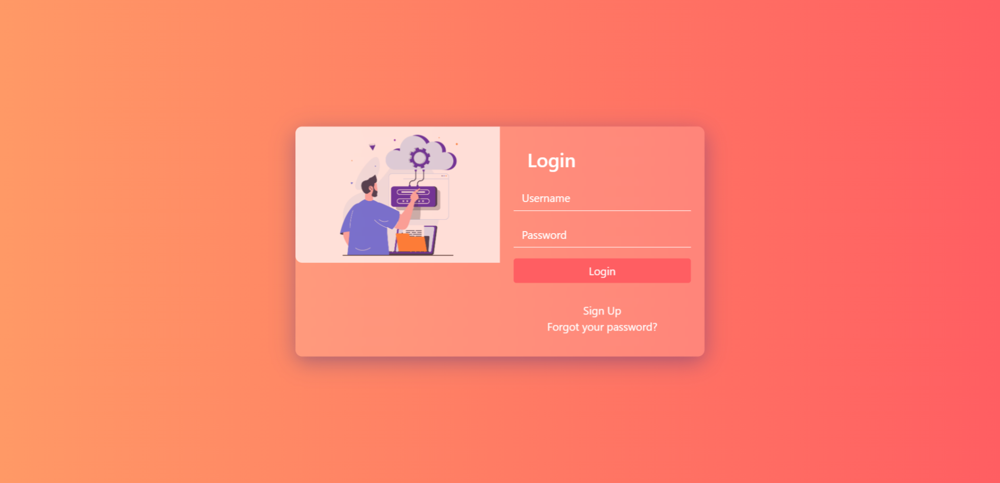
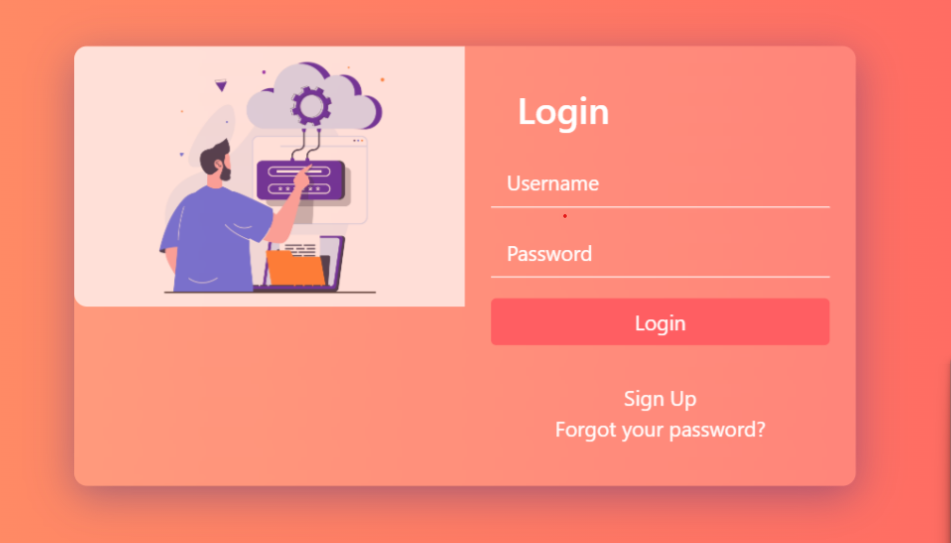

# Login Page Project
This project features a beautifully designed, responsive login page, implemented using HTML, CSS, and Bootstrap. The login form includes fields for username and password, and options to sign up for new users or recover a forgotten password.

## Features

*Responsive Design: This login page is built with mobile-first design principles in mind. It uses Bootstrap for responsive layouts, making it look great on screens of all sizes.

* Custom CSS Styles: The page includes custom CSS styling for an impressive visual aesthetic. It uses a combination of gradients and images for the background, and includes subtle animations to improve user interaction.

* Form Validation: The login form includes basic HTML5 form validation to ensure that the username and password fields are not left empty.

## Description
Our login page features a sleek, modern design with an engaging user interface. The left side of the login form features an image depicting cloud computing and login access, reinforcing the purpose of the page. The right side of the form includes inputs for the username and password, and a login button.

The username and password inputs are styled with a minimalist aesthetic, featuring white text and an underlined border. When focused, these inputs are highlighted, and a glowing effect around the input box is visible, providing clear visual feedback to the user.

The page includes transitions and animations, which serve to make the user experience smoother and more engaging. For instance, hovering over the 'Login' button causes it to change color and slightly scale up, giving the user feedback about their interactions.

Users who haven't registered can follow the 'Sign Up' link to create a new account, while those who have forgotten their password can follow the 'Forgot your password?' link to recover their account.

The login form is placed in a transparent card which scales up when hovered, making it a focal point of the page. The background of the page features a gradient effect combined with a background image, resulting in a visually pleasing aesthetic.

Here's a glimpse of how the login page looks:

A closer look at the login form:

## SEO Optimization
The page is SEO optimized with relevant tags and metadata. The title tag of the page is "Login Page," which is a crucial keyword for users searching for login page designs. The alt text for the image is also included, which helps in ranking the page in image search results.

Remember, SEO isn't just about search engines; it's also about understanding what your users are searching for and providing them with that information. We've designed this page to not only be search engine friendly but also user-friendly.

## Conclusion
This project is an excellent example of a modern, responsive, and user-friendly login page. Whether you're a beginner looking to understand web design or a seasoned developer looking for inspiration, this project has something for you.

Note: Always remember to replace placeholders with actual data in your project.

## Keywords
Login Page, HTML5, CSS3, Bootstrap, Responsive Design, User Interface, Form Validation, SEO Optimized.
